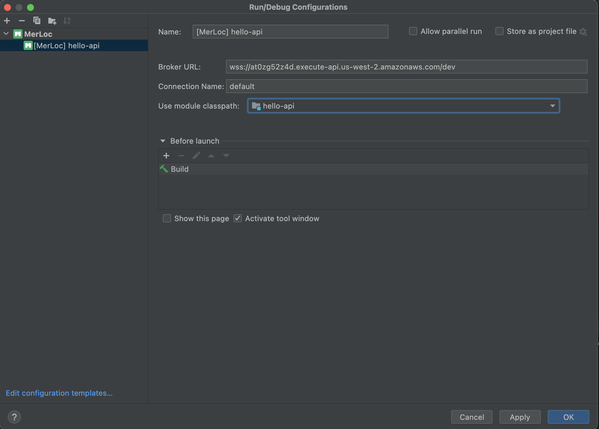
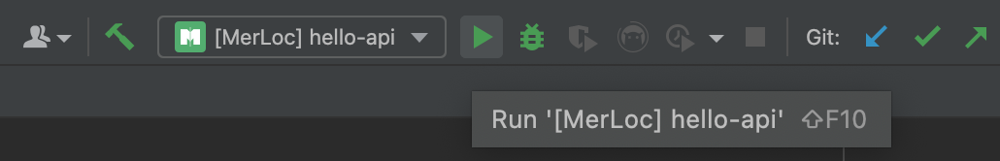
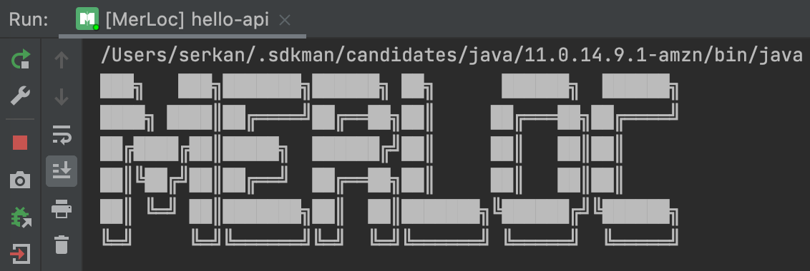
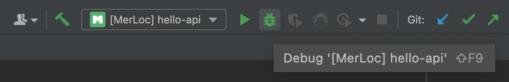

# MerLoc IntelliJ IDEA Plugin

MerLoc is a live AWS Lambda function development and debugging tool.

## Plugin Description

<!-- Plugin description -->

MerLoc allows you to run AWS Lambda functions on your local while they are still part of a flow in the AWS cloud remote
and increases your productivity by applying your local changes to the function without redeploy.

With the help of MerLoc, you don’t need to
- deploy to test your function
- add debug log statements around code to debug your function
- re-deploy after every change to check and verify whether it fixes the bug
- run the function as standalone (without being part of the flow shown above) locally in Docker locally and prepare/provide the input manually

MerLoc makes it possible to
- test your function locally without deploy to the AWS Lambda environment (so no wait for build, package and deploy)
- debug your function by putting breakpoints from your IDE
- hot-reload updated function on your local automatically to apply changes automatically (so again no wait for build, package and deploy)
- run the individual function locally while it is still part of flow shown above and use real requests from the AWS Lambda environment

Additionally, MerLoc propagates IAM credentials from the real AWS Lambda environment to your local 
so your local function runs with the same credentials. 
So this means that you can also test and verify IAM permission issues on your local.

## Installation

- Using IDE built-in plugin system:

  <kbd>Preferences</kbd> > <kbd>Plugins</kbd> > <kbd>Marketplace</kbd> > 
  <kbd>Search for "MerLoc"</kbd> > <kbd>Install Plugin</kbd>

- Manually:

  Download the [latest release](https://github.com/thundra-io/merloc-intellij-plugin/releases/latest) and install it
  manually using
  <kbd>Preferences</kbd> > <kbd>Plugins</kbd> > <kbd>⚙️</kbd> > <kbd>Install plugin from disk...</kbd>

## Setup

1) [Setup](https://github.com/thundra-io/merloc) MerLoc **Broker** to your AWS account
2) [Setup](https://github.com/thundra-io/merloc-java#41-gatekeeper-setup) MerLoc **GateKeeper** to your AWS Lambda function
3) Click `Add Configuration` and add a new `MerLoc` configuration.
   
4) Fill the `Broker URL` field with the URL you get from MerLoc **Broker** [setup](https://github.com/thundra-io/merloc#broker-setup) before.
   And select the project/module where your AWS Lambda function is located for the `Use module classpath` field.
   Then save the run configuration.
   

## How to Use

### Run

- Click `Run` to start MerLoc **AWS Lambda Runtime**.
  

- So you will see MerLoc banner in the console.
  

- Later on, trigger the AWS Lambda function. Then, the real request will be forwarded to 
  MerLoc **AWS Lambda Runtime** on your local through MerLoc **GateKeeper**. 
  So it will be executed locally and response will be returned
  to MerLoc **GateKeeper** and so to AWS Lambda function caller from there.
  

### Debug

- Click `Debug` to start MerLoc **AWS Lambda Runtime** in debug mode.
  

- So you will see MerLoc banner in the console.
  

- Put breakpoint from your IDE.
  

- Then, trigger the AWS Lambda function. So the forwarded request will stop at the breakpoint you put on your local
  and you can debug AWS Lambda function locally.
  

### Hot-Reload

- While running MerLoc **AWS Lambda Runtime** on your local, apply your changes in the source code(s).
  Then go to `Build` in the menu bar and click `Build Module` to re-build module in which you updated source code(s).
  

- After that you will see MerLoc log messages in your console which says that
  related function environment(s) (affected by changes) have been reloaded.
  

- Then, trigger your AWS Lambda function again, and you will see that
  your changes are live in the running function on your local.
  

For more information, please visit MerLoc
- [Broker](https://github.com/thundra-io/merloc) 
- and [Java SDK](https://github.com/thundra-io/merloc-java) 
Github pages.

<!-- Plugin description end -->
